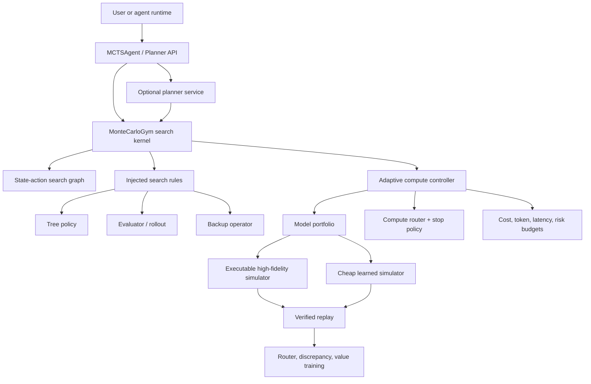
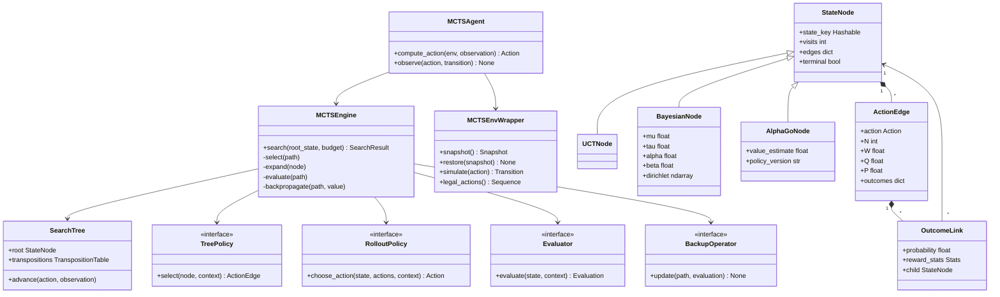
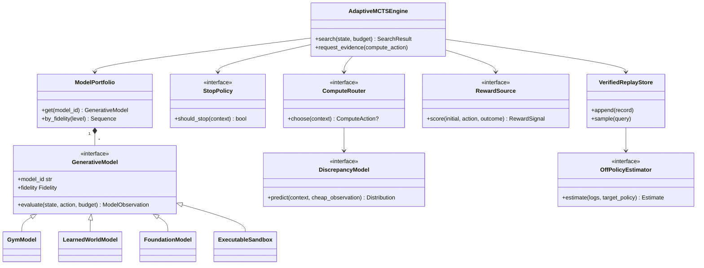
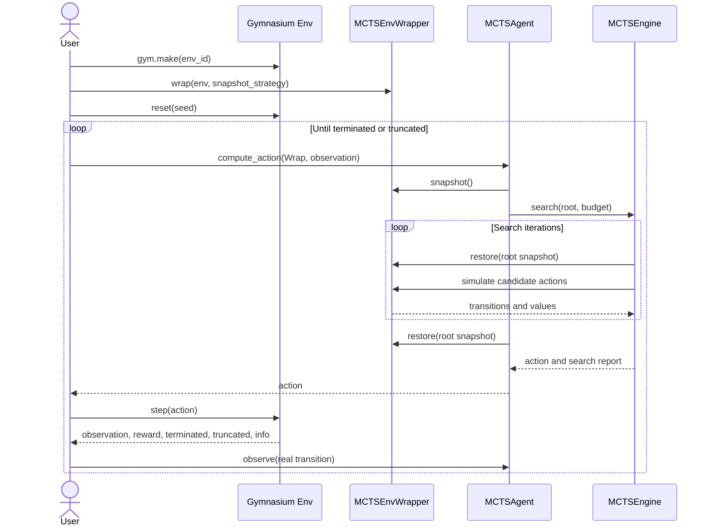

# MonteCarloGym Architecture Plan, Revision 2

**Project codename:** FidelityMCTS  
**Status:** architecture and implementation plan  
**Primary thesis:** learn when to think, which model to use, when to simulate,
when to verify, and when to act.

## 1. Executive decision

MonteCarloGym should not position itself as merely a larger catalogue of MCTS
variants. The classical algorithms remain important, but they are the
compatibility layer and experimental substrate.

The differentiated system is a **Gymnasium-compatible adaptive-compute planner**
that treats simulation and inference as heterogeneous, priced resources. At
each branch, it may choose:

- a cheap but biased learned world model;
- an intermediate model or heuristic;
- an expensive executable simulator or sandbox;
- an LLM or foundation model tier;
- a token budget and rollout depth;
- whether to request verification;
- whether further search has positive expected value;
- or whether to stop and execute the current best task action.

This is a meta-level planning problem nested inside ordinary planning. A task
action changes the candidate environment state. A compute action changes what
the planner knows about a task branch.

The open-source deliverable therefore has two deliberately separable layers:

1. **MonteCarloGym Kernel** - a correct, modular MCTS implementation and
   transactional Gymnasium generative-model wrapper.
2. **FidelityMCTS Research Layer** - model portfolios, branch-level compute
   routing, multi-fidelity uncertainty and discrepancy models, verified replay,
   budget-aware stopping, and optional causal/off-policy correction.

Users who only need UCT should not pay for foundation-model dependencies.
Researchers should be able to replace every policy without forking the engine.
Enterprise deployments should be able to run the planner as a sidecar without
embedding Python in an existing agent.

## 2. What is in and out of scope

### 2.1 In scope

- Gymnasium `reset()` and `step()` compatibility.
- Safe simulation by snapshot/restore, clone, or explicit generative model.
- State nodes, action edges, stochastic outcome links, and transpositions.
- UCT, Bayesian/Thompson, Crazy Stone, APV/PUCT, AlphaGo Zero, and
  RAVE/MAST presets.
- Learned and rule-based compute routing.
- Multiple simulator/model fidelities with measured cost, latency, tokens, and
  risk.
- Direct neural evaluation, rollouts, and mixed evaluation.
- Verified outcome replay and discrepancy learning.
- Reproducible experiment orchestration and complete resource accounting.
- Optional preference or reward models as objective sources.
- Optional causal estimators for logged router data.
- Python API, planner service, and thin adapters for non-Python agents.

### 2.2 Explicitly out of scope for v1

- Claiming that search eliminates reward design or human feedback.
- A universal causal world model.
- Direct, irreversible real-world actions during speculative search.
- Assuming arbitrary Gymnasium environments can be cloned correctly.
- Treating a learned simulator prediction as verified ground truth.
- Calling a collection of algorithm presets a research contribution.
- Reporting benchmark gains before preregistered experiments are run.

## 3. Design principles

1. **One engine, injected behavior.** Algorithm variants are configurations of
   policies, evaluators, node/edge statistics, and backup operators.
2. **Task and compute actions are distinct.** Search can optimize both without
   conflating their rewards or budgets.
3. **Statistics live on action edges.** A state may be reached through multiple
   paths, and an action may have multiple stochastic outcomes.
4. **Simulation is transactional.** Every planning iteration begins from a
   known snapshot and restores the live environment even after exceptions.
5. **Fidelity is evidence, not truth by declaration.** Every observation carries
   provenance, uncertainty, and measured resource use.
6. **Budget constraints are hard.** The engine cannot silently exceed token,
   latency, cost, accurate-call, or iteration limits.
7. **Verification drives learning.** Cheap predictions are paired with later
   executable outcomes whenever possible.
8. **Causality is targeted.** Use it where selection bias matters: router
   evaluation, logged interventions, and structured tool effects.
9. **Unsafe effects are outside speculative search.** Planning uses clones,
   sandboxes, dry runs, or approval-gated execution.
10. **Research claims are artifact-backed.** Every result must preserve config,
    code revision, seeds, traces, costs, and confidence intervals.

## 4. System decomposition



### 4.1 Layer A: environment and model adapters

The planner consumes the `GenerativeModel` protocol. A model can be:

- a reversible Gymnasium environment;
- a deep-copied environment instance;
- a learned state-transition/value model;
- an LLM-based world model;
- a browser, code, database, or workflow sandbox;
- a remote simulation service;
- or, only behind safety and approval boundaries, a real system.

The `MCTSEnvWrapper` is one adapter, not the universal abstraction. This keeps
the MCTS kernel usable in standalone domains while retaining a first-class
Gymnasium experience.

### 4.2 Layer B: classical search kernel

The kernel owns the mechanics that should not vary by paper:

- root synchronization;
- selection path construction;
- expansion;
- outcome sampling;
- evaluation/rollout dispatch;
- discounted return calculation;
- backup traversal;
- tree reuse;
- transposition lookup;
- deterministic seeding;
- budget enforcement;
- trace emission.

It does not own the UCT equation, PUCT equation, Bayesian posterior,
rollout action choice, value network, or backup statistic.

### 4.3 Layer C: adaptive compute controller

The controller sees the candidate branches, accumulated evidence, posterior
uncertainty, observed model discrepancy, and remaining resources. It selects a
`ComputeAction`:

\[
c_t = (a, m, b_{\mathrm{tok}}, d, v),
\]

where \(a\) is the task branch, \(m\) the model/fidelity, \(b_{\mathrm{tok}}\)
the token budget, \(d\) the rollout depth, and \(v\) a verification request.
Returning no compute action means stop searching.

A learned router should approximate expected value of computation:

\[
\operatorname{EVC}(c \mid h)
=
\mathbb{E}\!\left[
U(\pi_{h \cup o_c}) - U(\pi_h)
\mid h, c
\right]
- \lambda^\top \operatorname{Cost}(c),
\]

where \(h\) is current search evidence and \(o_c\) is the possible observation.
The planner executes the feasible compute action with greatest positive EVC;
otherwise it acts.

### 4.4 Layer D: learning and evidence

The high-fidelity outcome is not merely a score. It creates a paired record:

```text
(state, task action, search context,
 cheap prediction, cheap uncertainty,
 chosen route, route propensity,
 high-fidelity outcome, measured resources)
```

This record supports:

- value and transition model updates;
- fidelity discrepancy prediction;
- router training;
- calibration;
- off-policy evaluation;
- error taxonomy and regression tests;
- preference-pair construction when comparisons are valid.

## 5. Core object model

### 5.1 Classical kernel UML



`UCTNode`, `BayesianNode`, and `AlphaGoNode` are convenient capability presets.
The production implementation should prefer small statistic components over a
deep inheritance hierarchy when combinations are required.

### 5.2 Adaptive-compute UML



## 6. Required protocols

The public API should be built around structural protocols and immutable value
objects. Framework-specific adapters belong in optional packages.

```python
class GenerativeModel(Protocol):
    @property
    def model_id(self) -> str: ...

    @property
    def fidelity(self) -> Fidelity: ...

    def quote(
        self,
        *,
        token_budget: int,
        rollout_depth: int,
    ) -> ModelQuote:
        """Conservatively reserve resources before executing a query."""

    def evaluate(
        self,
        state: State,
        action: Action,
        *,
        token_budget: int,
        rollout_depth: int,
        rng: Random,
    ) -> ModelObservation: ...


class ComputeRouter(Protocol):
    def choose(self, context: RouterContext) -> ComputeAction | None:
        """Return None when another query is not worth its resources."""


class StopPolicy(Protocol):
    def should_stop(self, context: RouterContext) -> bool: ...


class RewardSource(Protocol):
    def score(
        self,
        *,
        initial_state: Any,
        action: Any,
        outcome: Any,
    ) -> RewardSignal: ...


class BackupOperator(Protocol):
    def update(self, path: SearchPath, evaluation: Evaluation) -> None: ...
```

`ModelQuote` reserves conservative cost, token, latency, and accurate-call
allowances before execution. `ModelObservation` must include estimated value,
variance, measured cost, tokens, latency, risk, terminal flags, optional next
state, and provenance metadata. The ledger rejects unaffordable quotes and
treats quote overruns as faults; predicted marginal value and expected cost
remain router features.

## 7. Search graph representation

### 7.1 State nodes and action edges

State statistics and action statistics must not be conflated:

- `StateNode` represents an information state or environment state.
- `ActionEdge` stores \(N(s,a), W(s,a), Q(s,a)\), a prior \(P(s,a)\), AMAF
  statistics, and model-specific evidence.
- `OutcomeLink` represents a stochastic reward/next-state result of an action.
- `SearchPath` is an iteration-local sequence of traversed edges and outcomes.

No canonical parent pointer is required. That makes transpositions and DAG
backups explicit and prevents accidental double backup.

### 7.2 State identity

Every adapter supplies a `StateCodec`:

```python
class StateCodec(Protocol):
    def key(self, state: State) -> Hashable: ...
    def serialize(self, state: State) -> bytes: ...
```

Hash collisions must be detectable in debug mode. For partially observed
problems, the key is an information state or belief identifier, not a hidden
environment state unavailable to the agent.

### 7.3 Tree reuse

After the live environment executes action \(a\) and observes outcome \(o\),
`SearchTree.advance(a, o)` re-roots at the matching child. If no matching child
exists or model/version identity changed incompatibly, a new root is created.
Subtree reuse is never allowed to carry stale hidden state across episodes.

## 8. Transactional Gymnasium compatibility

Gymnasium is a user-facing integration, not a restriction on the core model
protocol.

An adapter must implement one of these strategies:

1. native `get_state()` / `set_state()`;
2. environment-defined `clone_state()` / `restore_state()`;
3. safe deep copy of the unwrapped environment and RNG state;
4. reconstruction from a deterministic event log;
5. an external generative model that does not mutate the live environment.

The wrapper must preserve:

- environment internal state;
- NumPy/Python/framework RNG state;
- action and observation space RNG state;
- wrapper state;
- episode counters;
- terminated and truncated status.

Planning must run inside:

```python
with sim_env.transaction():
    # arbitrary search calls
    ...
# live state restored even if search raises
```

Environments without a valid strategy fail fast with a diagnostic. Silent,
partial copying is worse than rejecting the environment.

### 8.1 Standard user flow



`compute_action()` does not step the live environment. `observe()` is the only
place where a real transition enters tree reuse or verified replay.

## 9. Adaptive-compute search loop

The engine must permit direct evaluation, rollout evaluation, and model routing
without branching into separate engine implementations.

```python
def search(root_state: State, budget: SearchBudget) -> SearchResult:
    root = tree.synchronize(root_state)
    ledger = ResourceLedger(budget)

    while not ledger.exhausted:
        path = tree_policy.select_path(root, ledger)
        frontier = expander.expand(path.leaf)

        while True:
            context = router_context(frontier, path, ledger)
            if stop_policy.should_stop(context):
                break

            compute_action = compute_router.choose(context)
            if compute_action is None:
                break

            ledger.reserve(compute_action)
            observation = model_portfolio.get(
                compute_action.model_id
            ).evaluate(
                frontier.state,
                compute_action.task_action,
                token_budget=compute_action.token_budget,
                rollout_depth=compute_action.rollout_depth,
                rng=rng,
            )
            ledger.commit(observation)
            frontier.add_evidence(compute_action, observation)

        evaluation = evaluator.aggregate(frontier.evidence)
        backup_operator.update(path, evaluation)
        trace_sink.record(path, evaluation, ledger.delta)

    return action_selector.finalize(root, ledger.report())
```

### 9.1 AlphaGo Zero bypass

The bypass is a dependency-injection choice:

- `NeuralPolicyValueEvaluator.expand_and_evaluate()` returns priors and value.
- `NoRolloutPolicy` performs no environment rollout.
- `MeanBackup` propagates the direct value.

The engine still performs selection, expansion, evaluation, and backup. It does
not contain `if algorithm == "alphago_zero"` branches.

### 9.2 Multi-fidelity expansion

A search leaf may hold several observations for one task action. Evidence is
not overwritten when the accurate simulator is queried. The aggregator can:

- prefer verified evidence;
- perform a Bayesian update;
- correct a cheap estimate with a learned discrepancy distribution;
- retain model disagreement as epistemic uncertainty;
- or reject incompatible model versions.

## 10. Classical algorithm presets

The original six approaches remain supported by assembling components:

| Preset | Node/edge statistics | Tree policy | Evaluation | Backup | Extra sharing |
|---|---|---|---|---|---|
| UCT | \(N,W,Q\) | UCB1/UCT | random or heuristic rollout | mean | optional transpositions |
| DNG-MCTS | Normal-Gamma reward posterior and Dirichlet transitions | Thompson sampling | posterior generative model | Bayesian update | posterior cache |
| MCBRL | sampled MDP per root simulation | Thompson/root sampling | sampled model rollout | posterior/value update | real belief only |
| Crazy Stone | visits, mean, variance | soft/Boltzmann selectivity | rollout | mean, robust max, or mix | optional patterns |
| AlphaGo APV | \(N,W,Q,P\) | PUCT | value network plus fast rollout | mean | neural batcher |
| AlphaGo Zero | \(N,W,Q,P\) | PUCT | direct policy-value network | mean | root noise |
| RAVE/AMAF | direct and AMAF counts/values | blended UCT/RAVE | rollout with move trace | direct plus AMAF | move equivalence |
| MAST | global move statistics | any tree policy | softmax-biased rollout | base backup | global action table |

### 10.1 UCT

\[
a^* = \arg\max_a \left[
Q(s,a) + c\sqrt{\frac{\log N(s)}{N(s,a)}}
\right].
\]

Unvisited legal actions receive priority. `MeanBackup` updates total and mean
returns. Alternating-player domains use a configured value perspective instead
of unconditional sign flipping.

### 10.2 Bayesian planning

`BayesianNode` or attached edge statistics may contain:

- Normal-Gamma \((\mu,\tau,\alpha,\beta)\) reward parameters;
- Dirichlet transition counts;
- posterior samples and version identifiers.

DNG-MCTS performs local posterior sampling. MCBRL samples an MDP or parameters
from the real root belief and plans within that sample. Imaginary transitions
must not update the agent's real posterior.

### 10.3 Crazy Stone backups

Robust max is the value of the **most-visited** child, not the maximum noisy
sample mean:

\[
V_{\mathrm{robust}}(s)
= Q\!\left(s,\arg\max_a N(s,a)\right).
\]

Mix backup interpolates between mean and robust value:

\[
V_{\mathrm{mix}}(s)
= (1-\lambda_s)V_{\mathrm{mean}}(s)
  + \lambda_s V_{\mathrm{robust}}(s),
\]

where \(\lambda_s\) may increase with evidence and decrease with uncertainty.
The schedule is an injected strategy and an ablation target.

### 10.4 PUCT and neural evaluation

\[
a^* = \arg\max_a
\left[
Q(s,a)
+ c_{\mathrm{puct}} P(s,a)
\frac{\sqrt{\sum_b N(s,b)}}{1+N(s,a)}
\right].
\]

An APV preset mixes value-network and fast-rollout estimates. An AlphaGo Zero
preset uses only the policy-value network, optional root Dirichlet noise during
self-play, and visit-count action targets.

### 10.5 RAVE and MAST

RAVE updates AMAF statistics for moves appearing later in a rollout and blends
them with direct edge values using a visit-dependent coefficient. MAST is a
global rollout policy table that biases simulation actions by historical
returns. They are orthogonal and may be used together.

## 11. Foundation-model integration

### 11.1 Model portfolio

A useful initial portfolio is:

- **Cheap model:** a language world model such as Qwen-AgentWorld or Dreamer-7B
  used to predict tool effects, terminal likelihood, value, and uncertainty.
- **Accurate model:** an executable code/database/browser environment such as
  AgentWorldModel-1K, BrowserGym, or WorkArena.
- **Optional reasoning tiers:** small, medium, and strong language models with
  explicit token budgets.
- **Optional verifier:** tests, database invariants, browser assertions, policy
  checks, or human approval.

The package should ship adapters and synthetic fixtures, not redistribute model
weights or proprietary task data.

### 11.2 What the router observes

Features should include:

- node depth and visit counts;
- value gap between leading actions;
- predictive variance and model disagreement;
- historical cheap-versus-accurate discrepancy;
- novelty/out-of-distribution score;
- predicted tool risk and reversibility;
- remaining token, cost, latency, and accurate-call budget;
- expected branching factor;
- verification availability;
- model queue/load signals for service deployments.

### 11.3 What the router controls

The action space may be factorized:

1. choose a branch;
2. choose a simulator/model tier;
3. choose token budget;
4. choose rollout depth or horizon;
5. choose samples/best-of-\(n\);
6. choose verifier;
7. stop.

A monolithic categorical action is acceptable for small experiments. At scale,
factorization or constrained optimization will generalize better to new model
portfolios.

### 11.4 Self-learning loop


Only verified or clearly labelled weak evidence enters the corresponding
training objective. Model-generated trajectories must never be silently
relabeled as real outcomes.

## 12. Relationship to RLHF and preference optimization

Predictive MCTS can replace or augment the **policy-improvement mechanism** in
an RLHF-style pipeline, but it does not replace:

- preference collection;
- reward/preference modelling;
- safety policy;
- human escalation;
- distribution-shift monitoring.

Three supported patterns are:

1. **Inference-time planning:** search directly under a reward model or
   verifier, with no policy fine-tuning.
2. **Search distillation:** use MCTS visit distributions or verified action
   rankings as targets for supervised or preference optimization.
3. **Online improvement:** alternate planning, verification, replay, and
   conservative policy updates.

Reward hacking remains possible because a planner can exploit a misspecified
reward model more effectively than a myopic policy. Therefore search must
expose reward components, penalize uncertainty and unsafe states, use holdout
verifiers, and preserve human approval for high-impact actions.

## 13. Why and where to use causality

### 13.1 Strong argument for causality

Router logs are selected data. The expensive simulator is queried exactly where
the current router is uncertain, so verified outcomes are not an independent
sample of all branches. Naively training or evaluating the next router on those
outcomes can produce biased estimates.

The v1 causal layer should therefore focus on:

- logging route propensities;
- randomized exploration or audit traffic;
- inverse-propensity and doubly robust off-policy estimates;
- treatment-effect estimates for “use expensive model” versus “do not”;
- sensitivity analysis for unobserved confounding;
- structured causal graphs for tool effects when domain knowledge exists.

### 13.2 Argument against making causality the core

- General causal discovery from language traces is not reliably identified.
- Added assumptions can be harder to validate than predictive calibration.
- A causal world model would multiply implementation and evaluation scope.
- In many deterministic executable environments, direct intervention is
  available and simpler than inferring a graph.

Decision: make causal estimation an optional, well-tested evaluation module.
Require propensity logging from day one. Do not require every simulator to
implement a causal model.

## 14. Enterprise and agent integration

### 14.1 Deployment forms

- **Embedded Python:** direct import from PyPI.
- **Planner sidecar:** containerized HTTP/gRPC/MCP service with model adapters.
- **Batch research:** local or cluster runner consuming immutable configs.
- **Agent adapter:** thin TypeScript/Python plugin exposing
  `plan_and_execute`, `evaluate_options`, and `report_search`.

### 14.2 OpenClaw-style integration

A thin plugin should call the planner service. Full planning cannot be assumed
to fit a late `before_tool_call` hook because model selection may already have
occurred. Use one of:

- an explicit `plan_and_execute` tool;
- a planner proxy that owns the reasoning/tool loop;
- a trusted agent-harness integration once its lifecycle is stable.

OpenClaw or container sandboxing reduces risk but is not a universal security
boundary. Connectors should default to read-only or dry-run operations, require
explicit approval for consequential actions, and use scoped credentials.

### 14.3 Scale architecture

The planner service should separate:

- stateless search coordinators;
- shared model gateways and batching;
- simulator workers;
- distributed transposition/value caches;
- replay/event storage;
- metrics/tracing;
- asynchronous training jobs.

Every request gets a budget envelope and idempotency key. Model responses carry
model/version, prompt/template hash, sampling parameters, and measured usage.
Backpressure and circuit breakers are part of correctness because unavailable
high-fidelity models change the feasible compute policy.

## 15. Repository architecture

The target repository is:

```text
montecarlgym/
  pyproject.toml
  README.md
  LICENSE
  CONTRIBUTING.md
  src/montecarlgym/
    agent.py
    config.py
    types.py
    planner.py
    gym_wrapper/
      base.py
      snapshot.py
      deepcopy.py
      event_log.py
    core/
      tree.py
      path.py
      mcts.py
      expansion.py
      backup.py
      budget.py
      transpositions.py
    policies/
      tree_policies.py
      rollout_policies.py
      action_selection.py
      stopping.py
    evaluators/
      base.py
      rollout.py
      value.py
      mixed.py
      neural.py
    bayes/
      conjugate.py
      transition_models.py
      root_sampling.py
    sharing/
      rave.py
      mast.py
    adaptive/
      models.py
      portfolio.py
      routing.py
      discrepancy.py
      calibration.py
      replay.py
      causal.py
    integrations/
      gymnasium.py
      pytorch.py
      transformers.py
      mcp.py
      browsergym.py
      workarena.py
    experiments/
      runner.py
      registry.py
      metrics.py
      artifacts.py
  experiments/
    configs/
    suites/
    run.py
  tests/
    unit/
    integration/
    statistical/
    regression/
  paper/
    main.tex
    references.bib
```

The repository now implements the Phase 1 classical UCT vertical slice and the
adaptive protocols/controlled toy harness. Later classical presets and learned
adaptive-compute integrations remain implementation milestones.

## 16. Configuration and dependency injection

A fully resolved run configuration is immutable and serializable:

```yaml
seed: 41
planner:
  preset: fidelity_puct
  tree_policy: puct
  backup: mean
  stop_policy: learned_evc
models:
  - id: qwen_agentworld
    fidelity: cheap
    token_budget: 512
  - id: browsergym
    fidelity: accurate
budgets:
  max_cost: 20.0
  max_tokens: 8192
  max_accurate_calls: 4
  max_iterations: 800
logging:
  traces: full
  record_propensities: true
```

Configuration constructs objects through a registry. Core modules receive
instances, not global singletons. A programmatic API remains available for
custom research code.

## 17. Observability and artifacts

One search trace records:

- run, episode, step, node, and branch identifiers;
- environment and model versions;
- selected compute action and propensity;
- evidence before and after the query;
- predicted and measured resources;
- stop reason;
- chosen task action;
- real outcome when observed;
- reward components and verification status.

Aggregate reports include success, regret, risk, calibration, tokens, cost,
latency, model-call mix, and Pareto-frontier coordinates. Raw chain-of-thought
is neither required nor stored; structured decisions and model outputs are
sufficient for reproducibility and safer operations.

## 18. Safety and reliability requirements

- Restore environment state in `finally` blocks.
- Distinguish `terminated` from `truncated`.
- Never execute side-effecting actions to evaluate speculative branches.
- Validate action legality at the restored state.
- Enforce per-model timeouts and total deadlines.
- Mark stale or failed evidence; do not convert errors to zero reward silently.
- Redact secrets from state serialization and traces.
- Encrypt sensitive replay at rest in enterprise deployments.
- Treat prompt/tool output as untrusted data.
- Require approval for irreversible or externally visible actions.
- Version reward models and prevent unreviewed reward changes mid-run.

## 19. Testing strategy

### 19.1 Unit invariants

- snapshot then restore reproduces state and RNG stream;
- one simulation does not mutate the live environment;
- edge visit counts equal completed backups;
- UCT and PUCT handle unvisited actions;
- posterior parameters remain valid;
- robust max selects the most-visited child;
- mix backup stays within component bounds;
- RAVE does not double-count the direct edge;
- accurate-call, token, and cost limits are never exceeded.

### 19.2 Statistical tests

- UCT converges on stationary bandits;
- Thompson selection matches posterior sampling frequencies;
- Bayesian posterior moments match analytic fixtures;
- PUCT responds monotonically to priors at fixed statistics;
- calibrated model intervals attain expected coverage;
- router escalation rises with ambiguity and predicted discrepancy.

### 19.3 Integration and fault injection

- Gymnasium terminated/truncated episodes;
- stochastic environment cloning;
- simulator timeout and malformed response;
- model version change during a run;
- unavailable accurate simulator;
- replay write failure;
- concurrent planner requests;
- agent adapter dry-run and approval paths.

## 20. Implementation roadmap

### Phase 0: research contract

- Freeze task/compute action distinction.
- Publish trace schema and budget semantics.
- Run the included synthetic benchmark and add statistical fixtures.

### Phase 1: correct classical kernel

- Implement transactional Gymnasium wrapper.
- Implement state/action/outcome graph and search paths.
- Ship UCT, random rollout, mean backup, tree reuse, and tests.

### Phase 2: algorithm compatibility

- Add PUCT, value and mixed evaluators, no-rollout mode.
- Add Thompson/DNG statistics, MCBRL root sampling.
- Add robust/mix backup, RAVE, and MAST.

### Phase 3: multi-fidelity research layer

- Add model portfolio, fixed routers, discrepancy model, stop policies.
- Integrate one learned cheap model and one executable benchmark.
- Add token/model routing and complete cost accounting.

### Phase 4: learned routing and verified self-improvement

- Train EVC or contextual-bandit routers.
- Add calibrated uncertainty and verified replay.
- Add off-policy evaluation, randomized audit traffic, and ablations.

### Phase 5: scale and ecosystem

- Planner service, batching, distributed traces, and adapter SDK.
- PyPI release, OCI image, Hugging Face artifacts, and npm/agent plugin.
- External benchmark reproductions and independent contributor tasks.

## 21. Architectural decision records

| Decision | Choice | Reason |
|---|---|---|
| Research center | Adaptive compute and fidelity routing | Algorithm count alone is weak novelty |
| Core abstraction | `GenerativeModel`, not Gym only | Preserves Gym UX and standalone use |
| Tree representation | State nodes plus action edges/outcomes | Correct stochastic and transposition semantics |
| Algorithm design | Presets over separate engines | Prevents duplicated control flow |
| AlphaGo Zero | No-rollout evaluator injection | Avoids algorithm-name branches |
| Bayesian state | Modular posterior statistics | Supports DNG and root sampling cleanly |
| RLHF relation | Search as policy improvement, not objective replacement | Keeps human/reward role explicit |
| Causality | Optional off-policy and tool-effect layer | High value without overclaiming |
| High-fidelity execution | Sandbox/dry run by default | Search must not create speculative side effects |
| Open source | Modular core plus optional adapters | Low install weight and broad contribution surface |

## 22. Conference-level falsifiable claim

The paper should not claim “we support more MCTS algorithms.” It should test:

> Under equal resource and risk budgets, a branch-level adaptive planner that
> jointly allocates simulator fidelity, model tier, token budget, rollout depth,
> verification, and stopping achieves a better success-cost-risk Pareto
> frontier than single-model search, query-level routing, and fixed cascades.

This claim is novel enough to investigate, useful if true, and clear enough to
falsify. The experiment plan defines the evidence required.
